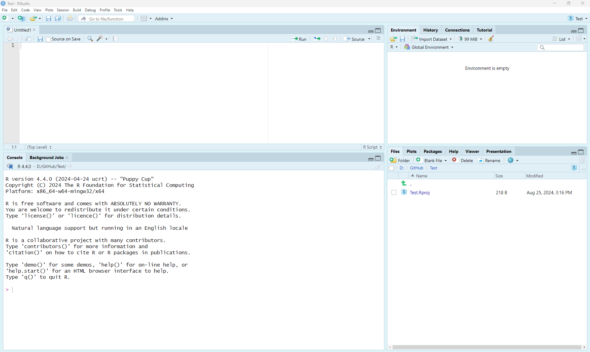
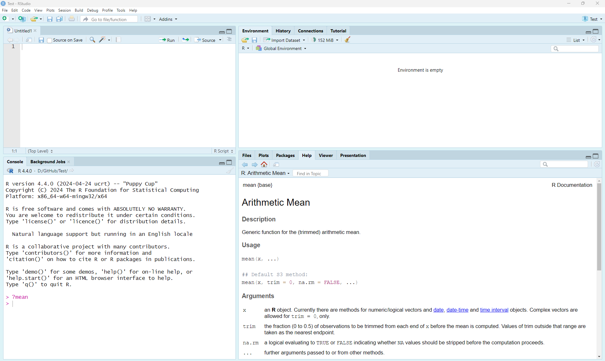
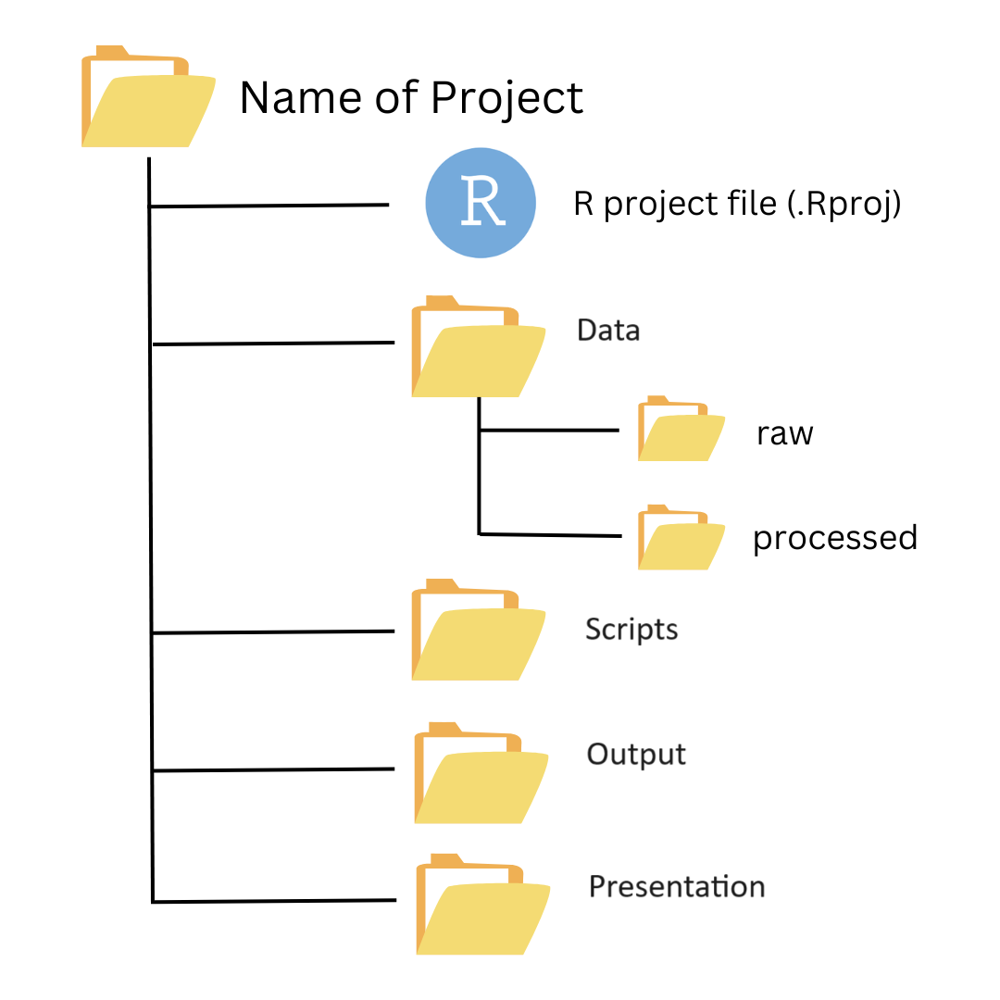

```{r setup, include=FALSE}
knitr::opts_chunk$set(echo = TRUE)
```

<a href="https://github.com/Smithsonian/IntroductionToR.git" class="github-corner" aria-label="View source on GitHub"><svg width="80" height="80" viewBox="0 0 250 250" style="fill:#151513; color:#fff; position: absolute; top: 0; border: 0; right: 0;" aria-hidden="true"><path d="M0,0 L115,115 L130,115 L142,142 L250,250 L250,0 Z"></path><path d="M128.3,109.0 C113.8,99.7 119.0,89.6 119.0,89.6 C122.0,82.7 120.5,78.6 120.5,78.6 C119.2,72.0 123.4,76.3 123.4,76.3 C127.3,80.9 125.5,87.3 125.5,87.3 C122.9,97.6 130.6,101.9 134.4,103.2" fill="currentColor" style="transform-origin: 130px 106px;" class="octo-arm"></path><path d="M115.0,115.0 C114.9,115.1 118.7,116.5 119.8,115.4 L133.7,101.6 C136.9,99.2 139.9,98.4 142.2,98.6 C133.8,88.0 127.5,74.4 143.8,58.0 C148.5,53.4 154.0,51.2 159.7,51.0 C160.3,49.4 163.2,43.6 171.4,40.1 C171.4,40.1 176.1,42.5 178.8,56.2 C183.1,58.6 187.2,61.8 190.9,65.4 C194.5,69.0 197.7,73.2 200.1,77.6 C213.8,80.2 216.3,84.9 216.3,84.9 C212.7,93.1 206.9,96.0 205.4,96.6 C205.1,102.4 203.0,107.8 198.3,112.5 C181.9,128.9 168.3,122.5 157.7,114.1 C157.9,116.9 156.7,120.9 152.7,124.9 L141.0,136.5 C139.8,137.7 141.6,141.9 141.8,141.8 Z" fill="currentColor" class="octo-body"></path></svg></a><style>.github-corner:hover .octo-arm{animation:octocat-wave 560ms ease-in-out}@keyframes octocat-wave{0%,100%{transform:rotate(0)}20%,60%{transform:rotate(-25deg)}40%,80%{transform:rotate(10deg)}}@media (max-width:500px){.github-corner:hover .octo-arm{animation:none}.github-corner .octo-arm{animation:octocat-wave 560ms ease-in-out}}</style>

# Learning Objectives

* Learn how to install [R](https://cran.r-project.org/) and [RStudio](https://www.rstudio.com/products/rstudio/download/)
* Understand how to create an **R** Project for effective project management
* Get oriented with the **R Studio** interface
* Run code and basic mathematical functions in the Console
* Learn to use `help()` to look up function documentation

This lesson is a compilation of lessons developed by Ramiro Crego, Grant Connette, Qiongyu Huang, Joseph Kolowski, Fernanda Ribeiro, and Jared Stabach.  Many thanks to all for sharing their code and knowledge.  We have also incorporated materials from workflows developed by the National Center for Ecological Analysis and Synthesis (NCEAS) of the University of California - Santa Barbara.  We'd encourage you to investigate the vast quantify of resources that are available on the [NCEAS](https://learning.nceas.ucsb.edu/) website.


# Introduction
  >What is R?  Why use R?

**R** is a very powerful statistical programming language that is used broadly by researchers around the world.  **R** is an attractive programming language because it is free, open source, and platform independent.  With all the libraries that are available (and those that are in rapid development), it is quickly becoming a one-stop shop for most of your analysis needs in ecological statistics.  Most academic statisticians now use **R**, which has allowed for greater sharing of **R** code and analysis packages to implement a variety of recommended methodologies.  One of the very first things academics often ask when hiring someone is simply, "Can you describe your **R** or statistical programming experience?"  It is now critical to have this background to be competitive for scientific (and many other) positions.

Among the reasons to use **R** include:  

1. Free and open source! If you are a teacher or a student, the benefits are obvious.
2. Runs on a variety of platforms including Windows, Unix and MacOS.
3. An unparalleled platform for programming new statistical methods in an easy and straightforward manner.
4. Contains advanced statistical routines not yet available in other software.
5. New add-on “packages” are being created and updated constantly.
6. State-of-the-art graphics capabilities.

**R** does have a steep learning curve that can often be intimidating to new users, particularly those without prior coding experience.  While this can be very frustrating in the initial stages, learning **R** is like learning a language where proficiency requires practice and continual use of the program.

Our advice is to push yourself to use this tool in everything you do.  At first, **R** will not be the easiest or quickest option.  With persistence, however, you will see the benefit of **R** and continue to find new ways to use it in your work.

## Installing R and R-Studio

**R** is available for Linux, MacOS X, and Windows (95 or later) platforms. Software can be downloaded from one of the [Comprehensive R Archive Network](https://cran.r-project.org/) (CRAN) mirror sites. It's best to choose the **R** mirror that is closest to your location.  Once installed, **R** will open a console where you run code. You can also work on a script file (preferred), where you can write and (importantly) save your work. Other windows will show up on demand, such as the plot tab.

**R Studio** is an enterprise-ready professional software tool that integrates with **R**.  It's known as an integrated development environment (IDE).  **R Studio** has some nice features beyond the normal **R** interface, with many users who feel it is easier to use than **R** (Fig. 1). Once you have installed **R**, you should also download and install **R Studio**.  For this course, we will work exclusively in **R Studio**.



## Getting Help

One of the most useful commands in **R** is `?`.  All **R** functions should have an associated help file. At the command prompt (signified by `>` in your Console window), type `?` followed by any command and you will be prompted with a help tab for that command (e.g., `?mean` Fig. 2). You can also search through the help tab directly by searching functions on the search bar. 



<br>
The internet also contains a vast quantity of useful information.  There are blogs, mailing lists, and various websites (e.g., https://stackoverflow.com/) dedicated to providing information about **R**, its packages, and potential error messages that you may encounter (among other things).  The trick is usually determining the key terms to limit your search.  I generally start any web-based search with *"R-Cran"*, which limits and focuses the search.  Using "*R*" as part of your key terms does not, by itself, limit the search.  Note also that error messages are your friend.  They tell you when you have typed something that the computer doesn't understand.  Google them (copy-and-paste) to figure out what they mean.

# Basic R Concepts

There are a few concepts that are important to keep in mind before you start coding. The fact that **R** is a programming language may deter some users who think “I can't program". This should not be the case for two reasons. First, **R** is an interpreted language, not a compiled one, meaning that all commands typed on the keyboard are directly executed without requiring you to build a complete program like in most computer languages (e.g., C, Pascal). Second, **R**'s syntax is very simple and intuitive. For instance, a linear regression can be done with the command `lm(y ~ x)` which means fitting a linear model with `y` as the response and `x` as a predictor.  You all speak multiple languages.  Learning to code in **R** should just be viewed as another language that requires time and practice. 

In **R**, in order for a command to be executed, a function always needs to be written with parentheses, even if there is nothing within the parentheses (e.g., `ls()` instead of `ls`). If you type the name of a function without parentheses, **R** will display the content of the function.  See what happens when typing `ls` instead of `ls()` in the Console.

When working with **R**, variables, data, functions, results, are stored in the active memory of the computer in the form of objects that you assign with a name (`x = c(1,2,3)`). The user can then execute actions on these objects with operators (arithmetic, logical, comparison) and functions (e.g., `x + 3`).

The name of an object must start with a letter (A-Z or a-z) and can be followed by letters, digits (0-9), dots (.), and underscores (_). Do **not** include spaces. 

When referring to the directory of a folder or a data file, **R** uses forward slash "/". You need to pay close attention to the direction of the slash if you copy a file path or directory from a Windows machine. 

It is also important to know that **R** discriminates between uppercase and lowercase letters in the names of objects, so that `x` and `X` can name two distinct objects.

# Starting R

## Setting your working directory

Like many other programs, you should start your session by defining your working directory - the folder where you will work. This will be the location on your computer where any files you save will be located.  To determine your current working directory, type: 

```{r, eval = F}
getwd()
```

Use `setwd()` to change or set a new working directory. For instance, you can set your working directory to be in your Documents folder on the `C:/` drive, or in any folder you prefer.  

```{r, eval = F}
setwd("C:/Documents/R_Practice")
```

If you are using a pre-defined [RStudio](https://posit.co/download/rstudio-desktop/) instance, like we are here (see the `.Rproj` file), there is no need to set your working directory.  This is very convenient, as relative paths are maintained, allowing you to share directories without a need to set the absolute path. Once you start working in projects, you should never need to run the `setwd()` command, which is a very good thing (more about this below).

<div style="float:right">

</div>

The goal is to organize your project so that all of the files needed to complete your analyses are contained within the main folder and subfolders (i.e., the folder contents are a compendium of your research).  This also means that you do not need to provide the full path to any of the files located in subfolders, as the relative path is maintained.  For example, you can point to the *Data* subfolder when reading in a table, as in the example below.  You can certainly provide the full directory to any data file, but it is unnecessary to do so.  Working with relative paths makes your code much more portable. 

```{r, eval=F}
# Example
table <- read.csv(file="Data/TheDataIWantToReadIn.csv", header=TRUE) # read a csv table stored in the data folder
```

Some common directories are:

* `Data`: Where to store your data files (often with subdirectories for raw and processed data)
* `Scripts`: Where to store your scripts for data cleaning and analysis
* `Output`: Where to store or write plots, graphs, or figures generated in your analysis
* `Documents`: Summaries or reports of analysis or other relevant project information
  
The directories you use will vary from project to project.  The key point is to keep all the resources you need to complete your analyses in a well organized project.  This will help in the future when you need to share files with collaborators or reproduce results.

# R Fundamentals

## Data Types

There are four fundamental data types in **R** that you will work with: 

1. Character: Data are string values (a word or words)
2. Numeric (also called double): Data are numbers that contain a decimal
3. Integer: Data are whole numbers (no decimal point)
4. Logical (also called boolean): Data that are either `TRUE` or `FALSE`, or `NA`

You can check the data type of an object using the function `class()` or using logical tests such as `is.numeric()`, `is.character()`, and `is.logical()`. To convert between data types you can use: `as.integer()`,  `as.numeric()`, `as.logical()`, `as. character()`.

For instance:
```{r Data Types, message = FALSE, warning = FALSE}
city <- 'Nairobi'
class(city)

number <- 3
class(number)

Integer <- as.integer(number)
class(Integer)

double <- 56.2
class(double)
is.numeric(double)

logical <- 3 > 5
logical
```

## Assigning Data to Objects
Since **R** is a programming language, we can store information as objects to avoid unnecessary repetition.  **Note**: Values are case sensitive (e.g., `x` is not the same as `X`)!

```{r, eval=T}
city <- "front royal"
summary(city)

number <- 2
summary(number)

numbers <- c(1,3,5,12)
summary(numbers)
```

## Special Characters
The `#` character is used to add comments to your code. `#` indicates the beginning of a comment and everything after `#` on a line will be ignored and not run as code.  Adding comments to your code is considered good practice because it allows you to describe in plain language (for yourself or others) what your code is doing.

```{r}
# This is a comment
```

The semicolon (;) defines a line continuation character so that you can write different commands on the same line of code.

```{r}
a <- 3; b <- 6; c <- a+b
a
b
c
```

## Naming Conventions

In addition to commenting your code, there are best practices to help make your code more readable.  This includes using naming conventions, such as **snake case** or **Camel Case**, when naming objects:

* some_use_snake_case
* SomePreferCamelCase

Choosing a [naming convention](https://en.wikipedia.org/wiki/Naming_convention_(programming)) is a personal preference.  Most important is to choose a format and be consistent!  You (and your collaborators) will thank you for it.

# R Data Structure

## Vectors
Vectors are a basic data structure in **R**.  They contain a sequence of data and can contain characters, numbers, or be TRUE/FALSE values.  **Remember**: If you are unsure or need help, use the help function (e.g., `help(seq)` or `?seq`).  Below are several ways to create vectors in **R**.

```{r vectors}
1:20
c(1,2,3,4,5)
seq(0,100,by=10)
rep(1:5,5)
rep("A rolling stone gathers no moss",4)
```

### Using Vector Notation
To see only part (i.e., a subset) of the data stored in a vector, you need to "ask" **R** to extract the information you want using square brackets (e.g., `[]`). Most commonly, you will indicate in square brackets the position of the data you want to extract (from beginning of the vector [1] to the Nth slot in the vector [n]). 

```{r}
x <- c(1,3,8,21,48,56,4,29)
x
# Using vector notation, we can extract any number in the sequence.  For instance, x[4] will return the 4th number in the sequence
x[4]
```

>**Questions**: 
  
* How would you extract the first 5 numbers in the sequence?
* What is the 5th value?
* What is the 2nd and 4th element of x
* Show all values except for the 2nd and 8th element of x
  
```{r Question1, results='hide', echo=FALSE}
x[1:5]
x[5]
x[c(2,4)]
x[-c(2,8)]
```

## Matrices and Dataframes
Matrices and dataframes are common ways to store tabular data.  Understanding how to manipulate them is important to be able to conduct more complex analyses.  Both matrices and dataframes are composed of rows and columns.  The main difference between matrices and dataframes is that dataframes can contain many different classes of data (numeric, character, etc.), while matrices can only contain a single class.

Create a matrix with 4 rows and 5 columns using the data from `x` above.  Consult the help (e.g., `help(matrix)` or `?matrix`) to determine the syntax required.

``` {r Matrix1}
test_matrix <- matrix(data = x, nrow = 4, ncol = 5)
test_matrix
# Note, I can assign any name to an object that I create.  Generally it is best to name things in a way that is meaningful, but we'll have some fun here!
superman <- matrix(data = x, nrow = 4, ncol = 5)
```

### Subset Matrices and Dataframes
Now, if we wanted to reference any value in the matrix, we could do so with matrix notation.  The first value in matrix notation references the row and the second value references the column.  **COMMIT THIS TO MEMORY!**  I remember this by thinking **R**oman **C**atholic.  So, if you wanted to view only the value in the 1st row, 5th column, you'd type:

``` {r Matrix notation}
#test_matrix(row,column)
test_matrix[1,5]
```

In addition to using positive integers to indicate the exact location of the subset of data we want to extract, you can also use other notation to indicate subsets of data that you want to include or exclude. You can use negative integers (to exclude data at a specific location), zero (to create empty objects with consistent format), blank spaces (to select the entire row/column), logical values (to select the data associated with TRUE values), or names (to select specific columns or rows by their names). Try to understand how each type of notation works!

  >Print (view) all the values in the 5th column?  
  
``` {r Matrix notation2}
test_matrix[,5]
# This literally says, extract all rows but only the 5th column from the object called test_matrix.
```

  >Print all values in the 4th row? 

``` {r Matrix notation2b}
test_matrix[4,]
```

  >Print all values in the 3rd row, but only the 2nd and 4th columns?

``` {r Matrix notation2c}
test_matrix[3, c(2,4)]
```

  >Can you append a character field to the matrix?  Use the `cbind()` (column bind) command to bind a new column, called 'countries'. 

``` {r Matrix notation3}
countries <- c("United States", "Pakistan", "Ireland", "China")
cbind(test_matrix,countries)

#Note that I am not changing/overwriting the contents of test_matrix.  I could, but I'd have to change my code to
#test_matrix <- cbind(test_matrix,countries)

# How do you think you would append a new row to the matrix (hint: use `rbind()`) 
```

  >Why is everything inside the table now enclosed in quotes?  Recall what we said about matrices only containing one data type.  What happens if I coerce this to a dataframe?

``` {r Dataframe}
test_dataframe <- data.frame(test_matrix,countries)
test_dataframe
# Have I changed the file type?
class(test_dataframe)
```

  >Can I rename the column headings?

``` {r Dataframe rename}
names(test_dataframe) <- c("Val1", "Val2", "Val3", "Val4", "Val5", "Countries")
test_dataframe
# Also see the colnames() function
```

  >Can I use the same matrix notation to reference a particular row and column?  Are there other ways to reference a value?

``` {r Dataframe ref}
test_dataframe[3,5]
test_dataframe[,5]
test_dataframe$Val5[3]
test_dataframe$Val5
test_dataframe[,"Val5"]
```

You can also use some very simple commands to determine the size of dataframes or matrices.

``` {r Dataframe dims}
nrow(test_dataframe)
ncol(test_dataframe)
dim(test_dataframe)
```

You can delete individual objects to clear your working directory (`rm(dataset)`), or start every script with the following command to make sure you are starting fresh (this is good programming practice):

```{r}
#rm(list=ls())
```

## Functions
**R** functions can be defined as a collection of arguments structured together for carrying out a definite task. Functions have optional input and output arguments that return a value. Custom functions can be easily constructed in **R**. Most often, however, we will use built-in functions within base packages or other downloadable packages.

Most functions have optional arguments or are given default values (in the function's help document, under the 'Usage' section, the optional arguments are given a default value following the "=" symbol). When you don't specify the optional arguments, they will take the default values. Functions normally can be called using the following syntax: `result_value <- function_name(argument1 = value1, argument2 = value2, ...)`.

```{r}
print(2+2)

x <- matrix(1:10, 5, 2)
x

y <- matrix(1:5)
y

df.example <- cbind(x, y)
df.example
```

### Pre-existing Functions
**R** contains many pre-existing functions.  Numeric functions include `sum()`, `mean()`, `sd()`, `min()`, `max()`, `median()`, `range()`, `quantile()`, or `summary()`. Try a few of these on the numeric vectors you have created.

``` {r Vector functions}
sum(x)
summary(x)
range(y)
```

## Calculations & Arithmetic Operators
As you'd expect, **R** can be used to perform basic calculations and report the results back to the user.

```{r calculations}
4+2
6*8
(842-62)/3
```

Exponentiation:
```{r}
2^3
```

Max and Min:
```{r}
vector_numbers <- c(2, 3, 4, 10)
max(vector_numbers) 
min(vector_numbers)
```

  >Can you calculate the square root and then subtract 5 for each element in vector_numbers?

## Logical Operations and Expressions
Relational operators (<, >, =, !=, >=, <=) evaluate a conditional expression and return TRUE or FALSE.  Commonly used relational operators are:

* `==` means 'is equal to'
* `!=` means 'is not equal to'
* `<` means 'is less than'
* `>` means 'is greater than'
* `<=` means 'is less than or equal to'
* `>=` means 'is greater than or equal to'

```{r}
# What is the maximum value of a vector of values?
3 > max(c(2,3,4,5))
```

# Other Resources: SWIRL
SWIRL is a user-generated program (also called a **package** or **library**) for learning how to code in **R**.  

## Installing SWIRL
To access the tutorial information, you must first install the package to make it accessible.  In the Console window (bottom left), type the following and press ENTER:

```{r install, eval = F}
install.packages("swirl")
```

This may take a little while, but when the stop sign in the upper right of the console window is gone, you can proceed. For any package you install in **R**, you will also need to turn them on before using them. You can do this with the `require()` or `library()` functions. Type this now: 

```{r install2, message=FALSE, warning = FALSE}
library(swirl)
```

**Note**: You may be prompted to select a "mirror" from which to download the package. If this is the case, it is recommended that you choose the mirror that is geographically closest to you.

To install the lesson, you will need to use:

```{r install3, eval = F}
install_from_swirl("R Programming")
```

*Find out more about other courses, and other download options here: https://github.com/swirldev/swirl_courses*

## SWIRL Lessons
There are many lessons within **R**.  Once SWIRL is loaded, you will be given the option of which lessons to complete.  Some of the core lessons can be found in the initial section labeled **R Programming**. The estimated time to compete required lessons is about 2 hours.  We recommend to start with the following lessons:

  1. **Basic Building Blocks (10 min)**
  2. **Workspace and Files (15 min)**
  3. **Sequences of Numbers (5 min)**
  4. **Vectors (8 min)**
  5. **Missing Values (5 min)**
  6. **Subsetting Vectors (12 min)**
  7. **Matrices and Data Frames (13 min)**
  8. Logic (optional)
  9. **Functions (30 min)**
  10. lapply and sapply (optional)
  11. vapply and tapply (optional)
  12. **Looking at Data (5 min)**
  13. Simulation (optional)
  14. Dates and Times (10 min)  (optional)
  15. **Base Graphics (10 Min)**

## Run SWIRL
Type the following to begin using SWIRL. Also, when restarting your session later, you’ll need to "turn on" SWIRL each time with either `library(swirl)` or `require(swirl)`. 

```{r install4, eval=F}
swirl()
```

**Have fun!**